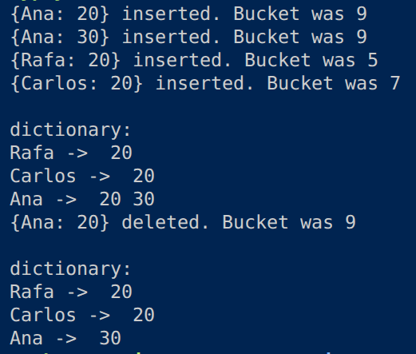

# Dictionary

The assignment was to implement a dictionary using a hash table data structure that does not overwrite values whose keys are identical.

After compiling (for C23) and executing `main`, we get the following output.

